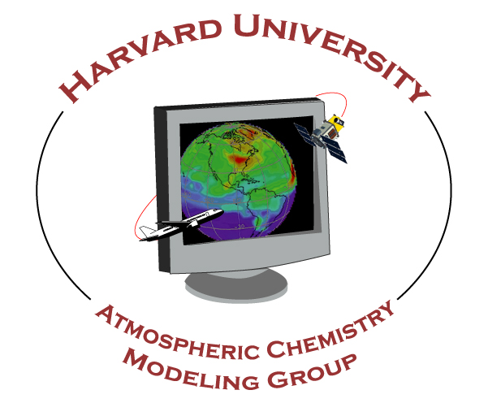

<a href="https://acmg.seas.harvard.edu"></a>

# cannon-env/envs: Environment files for Cannon with GNU 14.2.0 Compilers

### With minimal packages needed for GEOS-Chem

These environment files contain settings to load only the FASRC-built packages that are absolutely essential to running GEOS-Chem Classic and GCHP.  You can use these in simulation run scripts for the Cannon queues, or to initialize clean Spack software builds.

| Environment file                    | Model              | For compilers             |
| ----------------------------------- | ------------------ | ------------------------- |
| `gcclassic.rocky+gnu14.minimal.env` | GEOS-Chem Classic  | gcc, g++, gfortran 14.2.0 |
| `gchp.rocky+gnu14.minimal.env`      | GCHP               | gcc, g++, gfortran 14.2.0 |

## Using environment files

Use the `source` command to apply the settings in an environment file to your login environment:

```console
source <environment-file-name>
```

NOTE: In the `bash` shell, you can also use a `.` instead of `source`, e.g.

```console
. <environment-file-name>
```

For example:

```console
$ source ~/envs/gcclassic.rocky+gnu14.env
```

etc for the other environment files listed above.
